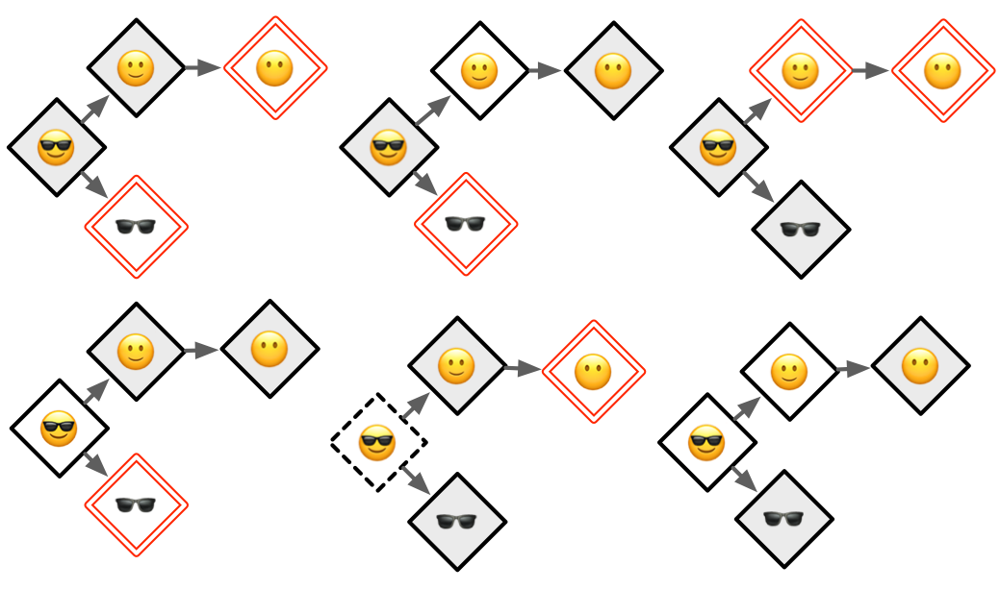
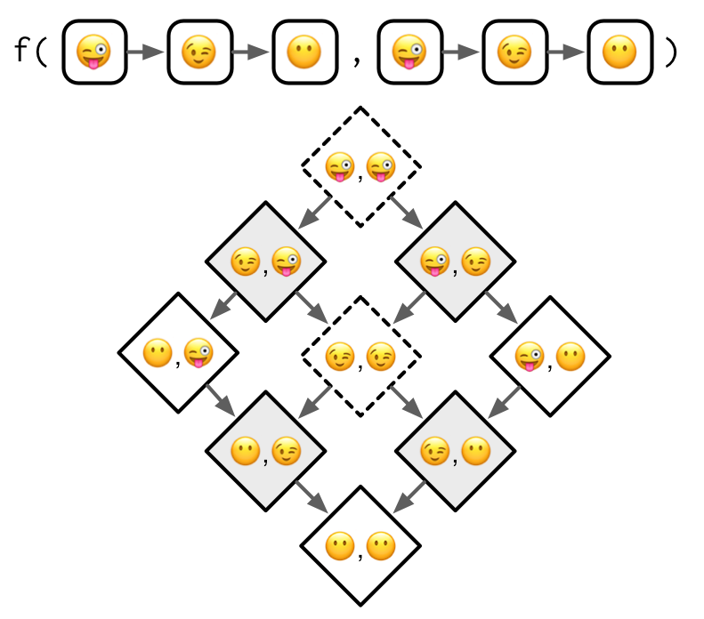

```{r setup, include=FALSE}
knitr::opts_chunk$set(
  cache = TRUE,
  cache.lazy = FALSE,
  include = TRUE,
  message = FALSE, 
  warning = FALSE
)
```

```{r xaringan-themer, include = FALSE}
library(xaringanthemer)
style_mono_light(
  base_color = "#3092FF",
  header_font_google = google_font("Josefin Sans"),
  text_font_google   = google_font("Montserrat", "300", "300i"),
  code_font_google   = google_font("Droid Mono"),
)
```

# S4 provides a formal approach to functional OOP. 

```{r, echo = FALSE, out.width = '50%', out.height='50%', fig.align="center"}

```

---

## Important features


"Functional" OOP: Methods dispatched by generics + argument signature

The __slot__, a named component of the object that is accessed using the specialized subsetting operator `@`. 

__methods Package__ provides functions for:
- Creating, instantiating, validating classes (`setClass()` and friends)
- Creating generics (`setGeneric()`)
- Assigning methods for dispatch (`setMethod()`)

This package is always available when you're running R interactively.

Use `library(methods)` in scripts, and to tell readers that you're using S4.
  
---
class: inverse center middle

# Overview of S4 classes, generics and methods

---

## Create a new S4 class 

```{r class-stuff}
Person <- setClass("Person", 
  slots = c(
    name = "character", 
    age = "numeric"
  )
)
```


### Create an instance

```{r}
pooh <- new("Person", name = "Pooh Bear", age = NA_real_)
```

-or-

```{r}
pooh <- Person(name = "Pooh Bear", age = NA_real_)
```

---

## Basic class access

.pull-left[
#### Print/show

```{r}
pooh
```

#### What are you?

```{r}
is(pooh)
is(pooh, "Person")
```
]

.pull-right[
#### Data access
```{r}
pooh@name
slot(pooh, "age")
```
]

---

### Creating setter/getter Generics

Friends don't make friends use slot syntax for accessing objects.

Two steps:

Creating setter/getter function generics with `setGeneric()`:

```{r setGeneric, results = 'hide'}
setGeneric("age", function(x) standardGeneric("age"))
setGeneric("age<-", function(x, value) standardGeneric("age<-"))
```

And then defining class methods for the generics with `setMethod()`:

```{r setMethod}
setMethod("age", "Person", function(x) x@age)
setMethod("age<-", "Person", function(x, value) {
  x@age <- value
  x
})

age(pooh) <- 95
age(pooh)
```

---
class: inverse center middle

# Classes

---
## Defining classes

Call setClass() with three arguments:

- The class __name__. By convention, S4 class names use UpperCamelCase.
- A named character vector that describes the names and classes of the __slots__ (fields). 
- A __prototype__, a list of default values for each slot. Technically, the prototype is optional, but you should always provide it.

.pull-left[
```{r, class, eval = FALSE}
Person <- setClass("Person", 
  slots = c(
    name = "character", 
    age = "numeric"
  ), 
  prototype = list(
    name = NA_character_,
    age = NA_real_
  )
)

me <- Person(name = "Brett")
str(me)
```
]

.pull-right[
```{r class-out, ref.label = "class", echo = FALSE}
```

Note that `setClass()`

- Creates the class
- Silently returns a function for constructing new class objects

]

---

## Inheritance

The `contains` argument to `setClass()` specifies a class (or classes) to inherit data and methods from. 

```{r inheritance}
setClass("Employee", 
  contains = "Person", 
  slots = c(
    boss = "Person"
  ),
  prototype = list(
    boss = new("Person")
  )
)

str(new("Employee"))
```

---

## Inheritance introspection

To determine what classes an object inherits from, use `is()`:

```{r is, eval=FALSE}
is(new("Person"))
is(new("Employee"))
```

```
[1] "Person"
[1] "Employee" "Person"  
```

To test if an object inherits from a specific class, use the second argument of `is()`:

```{r is_class, eval=FALSE}
is(pooh, "Person")
```

```
[1] TRUE
```

---

## Helper

`new()` is a low-level constructor. 

User-facing classes should always be paired with a user-friendly helper. 

A helper should always:

- Have the same name as the class, e.g. `Person()`.
- Finish by calling `methods::new()`.


```{r}
Person <- function(name, age = NA) {
  age <- as.double(age)
  
  new("Person", name = name, age = age)
}

Person("Pooh")
```

---

## Validator

The constructor automatically checks that the slots have correct classes. However, we might want to test that all slots have the same length as we want to store info about multiple people

```{r validator}
Person("Pooh", age = c(4, 95))
```

---

## Validator

To enforce these additional constraints we write a validator with `setValidity()`. It takes a class and a function that returns `TRUE` if the input is valid, and otherwise returns a character vector describing the problem(s):

```{r setValidity}
setValidity("Person", function(object) {
  if (length(object@name) != length(object@age)) {
    "@name and @age must be same length"
  } else {
    TRUE
  }
})
```


```{r,  eval=FALSE}
Person("Pooh", age = c(4, 95))
```
```
Error in validObject(.Object) : invalid class “Person” object: @name and @age must be same length
```

---
class: inverse center middle

# Generics and Methods

---

## Generics

The job of a generic is to perform method dispatch, i.e. find the specific implementation for the combination of classes passed to the generic.

To create a new S4 generic, call `setGeneric()` with a function that calls `standardGeneric()`:

```{r setgeneric}
setGeneric("myGeneric", function(x) standardGeneric("myGeneric"))
```


__`signature`__ allows you to control the arguments that are used for method dispatch. If `signature` is not supplied, all arguments (apart from `...`) are used

Here, we're using it to tell S4 that only the class of `x` needs to be considered for dispatch:

```{r signature}
setGeneric("myGeneric", 
  function(x, ..., verbose = TRUE) standardGeneric("myGeneric"),
  signature = "x"
)
```

---

## Methods

Define methods for generics with `setMethod()`. 

There are three important arguments: 
- name of the generic (__`f`__)
- name of the class (the __`signature`__)
- the method itself (the __`definition`__)

```{r setmethod}
setMethod("myGeneric", "Person", function(x) {
  # method implementation
})
```

In S4, unlike S3, the signature can include multiple arguments. This makes method dispatch in S4 substantially more complicated.

---

## Method introspection

- To list all the methods that belong to a generic, or that are associated with a class, use `methods("generic")` or `methods(class = "class")`

```{r}
methods("myGeneric")
```


```{r}
methods(class = "Person")
```


---

## Method introspection

To find the implementation of a specific method, use `selectMethod("generic", "class")`. You can get the arguments by looking at the `args()` of the generic

```{r, eval=FALSE}
selectMethod("myGeneric", "Person")
```

```
Method Definition:

function (x, ..., verbose = TRUE) 
{
    .local <- function (x) 
    {
    }
    .local(x, ...)
}

Signatures:
        x       
target  "Person"
defined "Person"
```

```{r, eval=FALSE}
args(getGeneric("myGeneric"))
```

```
function (x, ..., verbose = TRUE) 
NULL
```

---

## Common generics: `show`

`show()` = S4 `print()`

The show method for the Person class needs to have a single argument `object`:

```{r show_method}
setMethod("show", "Person", function(object) {
  cat(is(object)[[1]], "\n",
      "  Name: ", object@name, "\n",
      "  Age:  ", object@age, "\n",
      sep = ""
  )
})

pooh
```

---
class: inverse center middle

# Method dispatch

---

.pull-left[
__S4 dispatch__ is complicated because S4 has two important features:

* Multiple inheritance, i.e. a class can have multiple parents, 
* Multiple dispatch, i.e. a generic can use multiple arguments to pick a method. 

These features make S4 very powerful, but can also make it hard to understand which method will get selected for a given combination of inputs. In practice, keep method dispatch as simple as possible by avoiding multiple inheritance, and reserving multiple dispatch only for where it is absolutely necessary.

 Hadley uses a cool concept to illustrate this - an imaginary __class graph__ based on emoji:
]

.pull-right[
```{r, echo = FALSE, out.width = '60%', out.height='60%', fig.align="center"}
knitr::include_graphics("img/emoji.png")
```
]

---

## Single dispatch

Let's start with the simplest case: a generic function that dispatches on a single class with a single parent. The method dispatch here is simple so it's a good place to define the graphical conventions we'll use for the more complex cases.

```{r, echo = FALSE, out.width = '30%', out.height='30%', fig.align="center"}
knitr::include_graphics("img/single.png")
```

There are two parts to this diagram:

* The top part, `f(...)`, defines the scope of the diagram. Here we have a 
  generic with one argument, that has a class hierarchy that is three levels 
  deep.
  
* The bottom part is the __method graph__ and  displays all the possible methods 
  that could be defined. Methods that exist, i.e. that have been defined with 
  `setMethod()`, have a grey background. 
  
---

## Multiple Inheritance

.pull-left[
Things get more complicated when the class has multiple parents.


The basic process remains the same: you start from the actual class supplied to the generic, then follow the arrows until you find a defined method. The wrinkle is that now there are multiple arrows to follow, so you might find multiple methods. If that happens, you pick the method that is closest, i.e. requires travelling the fewest arrows. 
]

.pull-right[
```{r, echo = FALSE, out.width = '60%', out.height='60%', fig.align="center"}
knitr::include_graphics("img/multiple.png")
```
]

---

If no method can be found it will be highlighted with a red double outline. What happens if methods are the same distance - an ambiguous method? An __ambiguous__ method will be illustrated with a thick dotted border

```{r, echo = FALSE, out.width = '30%', out.height='30%', fig.align="center"}
knitr::include_graphics("img/multiple-ambig.png")
```

---

With multiple inheritances it is hard to simultaneously prevent ambiguity, ensure that every terminal method has an implementation, and minimise the number of defined methods (in order to benefit from OOP). For example, of the six ways to define only two methods for this call, only one is free from problems. 

```{r, echo = FALSE, out.width = '50%', out.height='50%', fig.align="center"}

```

---

## Multiple dispatch


After multiple inheritance, understanding multiple dispatch is straightforward. You follow multiple arrows in the same way as previously, but now each method is specified by two classes (separated by a comma).

```{r, echo = FALSE, out.width = '30%', out.height='30%', fig.align="center"}
knitr::include_graphics("img/single-single.png")
```

---

The main difference between multiple inheritance and multiple dispatch is that there are many more arrows to follow. The following diagram shows four defined methods which produce two ambiguous cases:

```{r, echo = FALSE, out.width = '30%', out.height='30%', fig.align="center"}

```

Multiple dispatch tends to be less tricky to work with than multiple inheritance because there are usually fewer terminal class combinations. In this example, there's only one. That means, at a minimum, you can define a single method and have default behaviour for all inputs.

---

## S4 Dispatch: KISS Principle
.pull-left[
S4 dispatch is complicated because S4 has two important features:

* Multiple inheritance, i.e. a class can have multiple parents, 
* Multiple dispatch, i.e. a generic can use multiple arguments to pick a method. 

These features make S4 very powerful, but can also make it hard to understand which method will get selected for a given combination of inputs. In practice, keep method dispatch as simple as possible by avoiding multiple inheritance, and reserving multiple dispatch only for where it is absolutely necessary.
]

.pull-right[
.center[]

<br>

> "Pluralitas non est ponenda sine necessitate", i.e., "Plurality is not to be posited without necessity"
>
> — William of Ockham

]
---
class: inverse center middle

# S4 and S3

---

## Using S3 classes with S4

`slots` and `contains` can be S4 classes, S3 classes, or implicit class of base type. 

Must register S3 classes with `setOldClass()`:

```{r, results = "hide"}
setOldClass("data.frame")
```

However, better to be specific and provide full S4 definition:

```{r, results = "hide"}
setClass("factor",
  contains = "integer",
  slots = c(
    levels = "character"
  ),
  prototype = structure(
    integer(),
    levels = character()
  )
)
setOldClass("factor", S4Class = "factor")
```


---

## Using S3 methods with S4

Can create new S4 generics or convert S3 generics to S4:

```{r, results = "hide"}
setGeneric("mean")
```

The existing function becomes the default (`ANY`) method:

```{r}
selectMethod("mean", "ANY")
```

